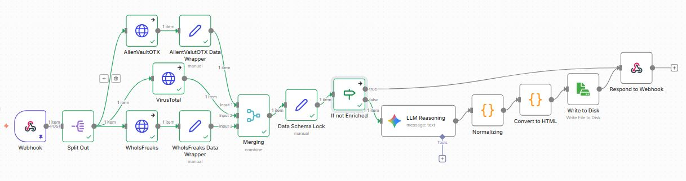

# Enrichment-Based Analysis Pipeline

This directory contains the enrichment-based implementation of the Agentic DNS Intelligence Pipeline, orchestrated using n8n.

Enrichment serves as the primary analytical driver, combining multiple threat-intelligence sources with LLM-based reasoning to provide contextual assessment of domain indicators.

---

## Directory Structure

- `nodes/`
  Conceptual documentation of the logical pipeline stages.

- `config/`
  Configuration artifacts, including the n8n workflow definition.

- `code/`
  JavaScript logic extracted verbatim from n8n Code nodes for transparency and reviewability.

- `diagram/`
  Architectural and workflow diagrams describing the pipeline.

- `results/`
  Representative output artifacts generated by pipeline executions.

---

## Pipeline Overview

## Notes

- This pipeline emphasizes enrichment and contextual reasoning.
- The n8n workflow JSON in `config/` is the authoritative execution definition.